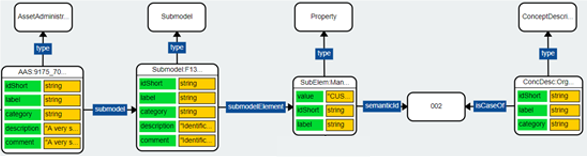

# Resource Description Framework
The Resource Description Framework ([RDF](https://www.w3.org/TR/rdf11-primer/)) is recommended standard of the W3C to unambiguously model and present semantic data. RDF documents are structured in the form of triples, consisting of subjects, relations and objects. The resulting model is often interpreted as a graph, with the subject and object elements as the nodes and the relations as the graph edges.

RDF is closely related to Web standards, illustrated by the fact that all elements are encoded using (HTTP-)URIs. As a common practice, the provision of additional information at the referenced location of an RDF entity directly allows the interlinking of entities based on the Web. This process, the following of links in order to discover related information, is called dereferencing a resource and is supported by any browser or web client. As the AAS namespace (`https://admin-shell.io/aas/<version>/<revision>/`) is not yet equipped with an hosting server, the dereferencing of the AAS entities is not possible yet. Nevertheless, the current state already allows the connection of distributed data sources through the Web, a mechanism known as [Linked Data](https://www.w3.org/standards/semanticweb/data). Connecting the capabilities of Linked Data with the expressiveness of the Asset Shell is one motivation for the RDF serialization.

In addition, RDF is the basis of a wide range of logical inference and reasoning techniques. Vocabularies like RDF Schema ([RDFS](https://www.w3.org/TR/rdf-schema/)) and the Web Ontology Language ([OWL](https://www.w3.org/TR/owl2-overview/)) combine the graph-based syntax of RDF with formal definitions and axioms. This allows automated reasoners to understand the relation between entities to some extent and draw conclusions.

Combining both worlds, the RDF mapping of the Asset Administration Shell can provide the basis for complex queries and requests. SPARQL, the standard query language for the Semantic Web, can combine reasoning features with the integration of external data sources. In order to benefit of these abilities, the AAS requires a clear scheme of its RDF representation. In the following, the necessary transformation rules are presented, followed by an illustration of relevant parts of the scheme and an example. The complete [data model](rdf-ontology.ttl) together with the [schema](shacl-schema.ttl) are listed in this repository.

##	RDF Mapping Rules
The concepts of the RDF and the derived RDF serialization of the AAS are explained by the mapping rules. These rules are implemented by the [generators](https://github.com/aas-core-works/aas-core-codegen) used to create the ontology and shacl files based on the independent project [aas-core-works](https://github.com/aas-core-works/). The main design rules the following:

-	The default serialization format is Turtle - also for the ontology and the shapes. However, several equivalent serializations exist for RDF. Among them, the Turtle syntax is regarded as the most appropriate compromise between readability and tool-support. Other formats (RDF/XML, JSON-LD, N3, etc.) can be used without any loss of information.
-	[Shape Graphs](./shacl-schema.ttl) represent the validation schema. The data model itself is an [RDF ontology](./rdf-ontology.ttl). As RDF itself is following the open-world-assumption, [SHACL](https://www.w3.org/TR/shacl/) constraints are necessary in order to enable schema validation. Similarly to XSD for XML, the SHACL format can be used to describe constraints (called  shapes) of RDF graphs.
-	Every entity is encoded as either an IRI or a Literal. RDF uses IRIs for both entities and relations. If no IRI is predefined, a globally unique IRI is generated. Primitive values are encoded as Typed Literals. 
-	Entities are enhanced with well-known RDF attributes. Interoperability of concepts and attributes is the main advantage of the RDF mapping. Therefore, applying common attributes (`rdf:type` (similar to `modelType` discriminator in JSON), `rdfs:label`, and `rdfs:comment`) enables the usage of standard tools and interfaces.
-	Repeating elements are described once and then linked using their IRI identifier. If a distinct element appears more than one time in the original model but in a different context, for instance in more than one submodel, the RDF entity represents the combination of all attributes.
-	Multilanguage Strings are split into distinct language strings (`rdf:langString`). Objects are expected to contain a singular information entity, and the currently available tools would not recognize the AAS LangString pattern.
-  Multiple object values are represented by repeating the property, one for each value object.
-  Abstract AAS classes are modeled in the ontology, nevertheless, using them leads to validation errors in the shapes. RDF does not contain a concept for abstract classes, therefore custom checks using SPARQL queries are supplied.

##	Example Overview
RDF is often regarded as a graph model, as it provides the flexibility to interlink entities at any stage. In the following, the [complete example](./examples/Complete_Example.ttl) is originally provided in Turtle but accompanied with visualizations of the represented graph (see Fig. 1): Attributes referencing non-literal values are shown as directed links while Literal values are drawn together with the corresponding entity itself. In order to increase readability, the namespace declaring sections are omitted. The complete example with all namespaces can be found in the [example folder](examples). One can see the additionally inserted triples for `rdf:type`, `rdfs:label`, and `rdfs:comment` as determined by Rule 4. The first attribute states the instance’ class. The second provides its commonly used name, for instance based on the idShort attribute. `rdfs:comment` supplies a short description about the regarded entity, based on the description value. The generally available tools, for instance the open source tool [Protégé](https://protege.stanford.edu), render these attributes and display the correct class hierarchy, render the elements with their labels or supply short explanations based on the comments.

___Figure 1: Simplified graph of the core classes in the example___

A comprehensive set of generated examples is also provided in the subfolder [examples/generated](./examples/generated), always containing a complete and a minimal version of each class. The files have been created using the [aas-core3.0rc02-testgen](https://github.com/aas-core-works/aas-core3.0rc02-testgen) project to simplify the maintenance process and to stick directly to the efforts made at [aas-core-meta](https://github.com/aas-core-works/aas-core-meta).